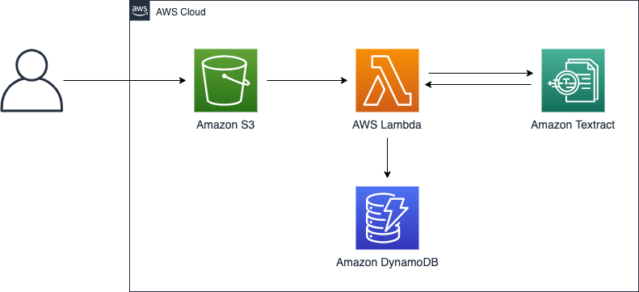

# Sample Document Scanner Project
**Note: This is not Production grade and simply meant as a demo**

## Description

This Sample Document Scanner is a simple serverless solution that allows you to extract text and data from documents. For this solution, a user will put the file to be processed in an s3 bucket. The s3 bucket will trigger an event that will call an AWS Lambda function responsible for taking that file from s3 and making a call to Amazon Textract to extract the texts in the file. One the extraction is done, Lambda will save the result in an Amazon DynamoDB table.


 


To run the solution, clone/download the project. To deploy the solution follow the steps below:

## AWS Services

* Amazon S3
* AWS Lambda
* Amazon Textract
* Amazon DynamoDB

## Pre-Requisites

* Git
* SAM CLI - <https://docs.aws.amazon.com/serverless-application-model/index.html>

## Instructions

The instructions below cover installation on Unix-based Operating systems like macOS and Linux. You can also use an AWS Cloud9 enviornment or EC2 instance to deploy the solution.

### Deploy with SAM

#### Build

First we will build the serverless app using SAM, and generate our deployment template:

```shell
sam build
```

#### Deploy

Now we can run the guided deployment process on the first deploy:

```shell
sam deploy --guided
```

You can accept most defaults, and supply the following parameters:

```
	Looking for config file [samconfig.toml] :  Not found

	Setting default arguments for 'sam deploy'
	=========================================
        Stack Name [sam-app]: textract-poc
        AWS Region [us-east-2]: 
        #Shows you resources changes to be deployed and require a 'Y' to initiate deploy
        Confirm changes before deploy [y/N]: y
        #SAM needs permission to be able to create roles to connect to the resources in your template
        Allow SAM CLI IAM role creation [Y/n]: y
        Save arguments to configuration file [Y/n]: y
        SAM configuration file [samconfig.toml]: 
        SAM configuration environment [default]:  
```

Once the deployment is complete, you can try uploading an image with text to s3 and check DynamoDB to confirm extracted texts are being saved.

### Cleanup

If you are done experimenting with this solution, you can tear down the resources by deleting the CloudFormation stack from the AWS Console, or using the command:

```shell
aws cloudformation delete-stack --stack-name textract-poc
```


## Improvements

* Add Amazon SQS to allow for async batch processing
* Add an API Gateway and Lambda function to query the results in DynamoDB
